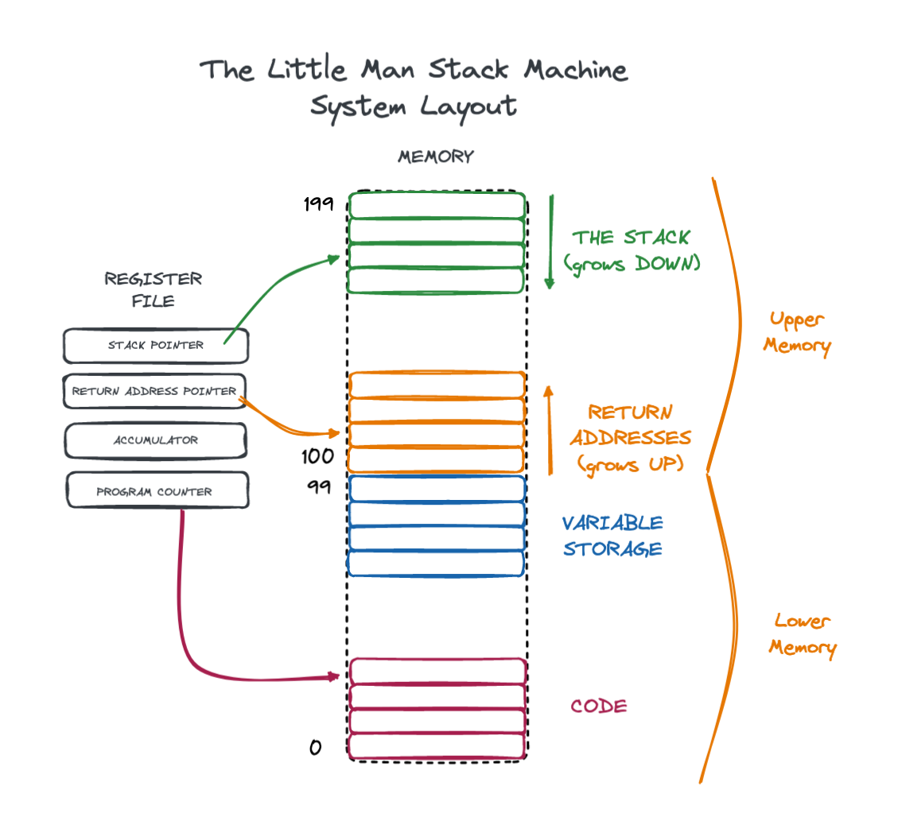

# Little Man Stack Machine

The year is 1970, and, for the last five years, the [Little Man Computer](https://en.wikipedia.org/wiki/Little_man_computer) 
has been the dominant system in the burgeoning computer revolution.  The chip that the computer uses, the [x80 Trix](https://en.wikipedia.org/wiki/X86), 
produced by [Mintel](https://en.wikipedia.org/wiki/Intel), however, is starting to show its age.  Worse, a competitor, [United Fruit Computing](https://en.wikipedia.org/wiki/Apple_Inc.), has just 
released a new chip, the [eM-Uno](https://en.wikipedia.org/wiki/Apple_M1), which puts Mintel's Little Man Computer industry dominance at risk.

Mintel has decided to create a new, more advanced chip, the [hAPY-243](https://en.wikipedia.org/wiki/Intel_iAPX_432), which:

* Supports a much larger set of instructions
* Supports more memory
* Includes support for the concept of a stack

This new, advanced architecture will allow LMC programmers to write much more compact code and even use a new-fangled
technology called "function calls".

This new chip will support a machine called The Little Man Stack Machine(tm): A Revolution in Little Man Computing(c).

The only problem is, Mintel is having a tough time actually producing the chip.  They announced it last year in a bit
of a panic due to the em-Uno, but so far no one has seen this new chip.  

Mintel needs help, and fast.

## The LMSM Achitecture

The LMSM architecture is backwards compatible with the LMC.  All instructions that work on LMC will work on LMSM:

| code | assembly  | asm_instruction    | description                                                                                  |
|------|-----------|--------------------|----------------------------------------------------------------------------------------------|
| 1xx  | ADD xx    | Add                | Add the value stored in location xx to the current value in the accumulator                  |
| 2xx  | SUB xx    | Subtract           | Subtract the value stored in location xx to the current value in the accumulator             |
| 3xx  | STA xx    | Store              | Store the value in the accumulator to the location xx                                        |
| 5xx  | LDA xx    | Load               | Load the value from location xx into the accumulator                                         |
| 6xx  | BRA xx    | Branch             | Unconditionally branch to the asm_instruction at the location xx                             |
| 7xx  | BRZ xx    | Branch if zero     | Branch to the asm_instruction at the location xx if the accumulators value is zero           |
| 8xx  | BRP xx    | Branch if positive | Branch to the asm_instruction at the location xx if the accumulators value is positive       |
| 901  | INP       | Input              | Get numeric input from the user                                                              |
| 902  | OUT       | Output             | Print the current value of the accumulator                                                   |
| 000  | HALT, COB | Halt               | Stop the computer                                                                            |
|      | *DAT*     | Data               | Assembler asm_instruction to simply write the raw value following this declaration to memory |

As with the LMC, LMSM assembly may use labels to reference particular parts of memory.

Any valid LMC program should also be a valid LMSM program.

In addition to these standard LMC instructions, a new asm_instruction has been added to the standard set:

| code | assembly | asm_instruction | description                                      |
|------|----------|-----------------|--------------------------------------------------|
| 4xx  | LDI xx   | Load Immediate  | Loads the value xx into the accumulator directly |

This asm_instruction allows programs to load a value "immediately" into the accumulator.

### Capped Values

As with the original Little Man Computer, the values stored in memory locations and in the accumulator should be capped
between -999 and 999.

### The LMSM Accumulator

The biggest difference between the x80 Trix and the hAPY 243, is that the hAPY 243 chip has double the memory of the
x80 Trix.  However, old instructions cannot address the upper part of memory due to the fact that LMC machine code only
allows for references from 0-99.

Instead of acting like raw memory, the upper 100 slots of memory in the LMSM provide support for a _stack_.  The new
machine has two new registers:

* `stack_pointer` - points to top value on the stack
* `return_address_pointer` - points to the current return address, if any

The stack in the LMSM starts at the *TOP* of memory (position 199) and grows *DOWN*, where the return address stack starts 
at the memory location 100 and grows *UP*.

Here is a schema of the LMSM architecture:



#### Stack Instructions

To work with these new registers and this new memory, the LMSM provides a series of stack-based instructions:

| code | assembly | asm_instruction | description                                                                                                              |
|------|----------|-----------------|--------------------------------------------------------------------------------------------------------------------------|
| 920  | SPUSH    | Stack push      | Pushes the current value of the accumulator onto the top of the stack                                                    |
| 921  | SPOP     | Stack pop       | Pops the current value off the stack into the accumulator                                                                |
| 922  | SDUP     | Stack duplicate | Duplicates the current value on the top of the stack                                                                     |
| 923  | SDROP    | Stack drop      | Drops the top value from the stack                                                                                       |
| 924  | SSWAP    | Stack swap      | Swaps the top two values on the stack                                                                                    |
| 930  | SADD     | Stack add       | Pops the top two values on the stack, adds them and pushes the result onto the stack                                     |
| 931  | SSUB     | Stack subtract  | Pops the top and second values on the stack, subtracts the top from the second, and pushes the result onto the stack     |
| 932  | SMUL     | Stack multiply  | Pops the top two values of the stack,  multiplies them and pushes the result onto the stack                              |
| 933  | SDIV     | Stack divide    | Pops the top and second values on the stack, divides second value by the top value, and pushes the result onto the stack |
| 934  | SMAX     | Stack maximum   | Pops the top two values of the stack and pushes the maximum value of the two back onto the stack                         |
| 935  | SMIN     | Stack minimum   | Pops the top two values of the stack and pushes the minimum value of the two back onto the stack                         |

In addition to these instructions, the following virtual asm_instruction is available:

| code | assembly    | asm_instruction      | description                                   |
|------|-------------|----------------------|-----------------------------------------------|
|      | *SPUSHI xx* | Stack push immediate | Pushes the value xx onto the top of the stack |

This asm_instruction will compile down to the following to actual instructions in the following manner:

```
00:  SPUSHI 22
```

becomes

```
00:  LDI 22
01:  SPUSH
```

The assembler will need to take this two-slot asm_instruction into account when creating machine code.

Note this command is pronounced in such a way that it rhymes with "Sushi"

#### Function Call Instructions

In addition to these raw instructions for working with the stack, Mintel also has introduced the notion of a "function call".
These so called "function calls" are an abstraction that allow programmers to work at a higher level of abstraction than
normal assembly does.

| code | assembly | asm_instruction | description                                                                                                              |
|------|----------|-----------------|--------------------------------------------------------------------------------------------------------------------------|
| 910  | JAL      | Jump & Link     | Jumps to the function address on the top stack, pushing next instruction address onto the `return_address_pointer` stack |
| 912  | RET      | Return          | Pops the top value off the return address stack and jumps to it                                                          |

Using these three instructions, LMSM implements the following calling convention:

* A function is called by jump-and-linking to it.  All arguments are assumed to be on the stack.
* When a function is complete it should leave its value on the top of the stack, with the arguments consumed
* At this point `RET` will return execution to the callee

##### Function Call Example

Consider an example where we wish to call a function located at position 50 that returns the maximum value of two
parameters passed to it with two arguments, 1 and 2.  

We would have the following LMSM machine code:

```
00: 401       # LDI 1  - load the constant 1
01: 920       # SPUSH  - push the value onto the stack as argument 1
02: 402       # LDI 2  - load the constant 2
03: 920       # SPUSH  - push the value onto the stack as argument 2
04: 450       # LDI 50 - load the constant 50
05: 910       # JAL    - call the function, consuming the 50 and setting the return_address register to 07
07: ...       # this code can assume the return value of the function is on the top of the stack
...
50: 925       # SMAX   - compute the max of the two arguments and leave on the top of the stack
51: 911       # RET    - jumps back to the address currently stored in return_address and pops the return_address from under the return value
```

##### The`CALL` Assembly Pseudo-Instruction

In order to make assembly programming on the LMSM more enjoyable, the `CALL` pseudo-instruction is supported.

| code | assembly  | asm_instruction | description                            |
|------|-----------|-----------------|----------------------------------------|
|      | *CALL xx* | Call            | Calls a function at memory location xx |


The `CALL` pseudo-instruction takes an argument, the address of the function to call.  The `CALL` pseudo-instruction
then "compiles" down to three instructions:

* An `LDI` that loads the address of the function to call into the 
accumulator
* A `SPUSH` that pushes this value onto the stack
* A `JAL` that jump-and-links to it.

As an example, consider the following assembly:

```
...
10: CALL FOO
...
32: FOO DUP
33: RET
...
```

Here we have a `CALL` instruction targeting the method declared with the label `FOO`.  Let's assume that `FOO` ends
up at position 32 in memory.  In that case, the `CALL FOO` assembly pseudo-instruction will assemble down to the
following machine instructions:

```
LDI 32    // load the constant 32 into the accumulator
SPUSH     // push it onto the stack
JAL       // issue a JAL instruction, which will consume the 32 and jump to it
```

## A High-Level Programming Language: Firth

In addition to this new exciting hardware, Mintel is interested in producing a "high level language" for their new chip.
They expect that most programmers will continue to use assembly to program their chips, but that a few academic institutions
might be interested in experimenting with such a futuristic language.

Mintel has an employee who appears to be a bit crazy, but who claims he has developed a high level language for the new
platform, with a nearly-complete compiler.  He calls this new language "Firth" and, to be frank, the language looks a 
little insane, although not as insane as the inventor himself.  

Firth is a stack-based language that uses Reverse Polish Notation and some strange syntax, but it does allow programmers
to write more abstract programs for the LMSM.

Here are the basic components of the language:

```
1                             // number literals, which push the given value on to the stack

1 2 +                        // math ops, which are post-fix, RPN style.  This example pushes 1, then 2 onto the stack then adds them

get                          // this gets an integer from the user and places it on the stack

dup                          // duplicates the top of the stack

drop                         // drops the top of the stack

.                            // this prints the current element on the top of the stack

var x                        // declares a variable named `x` with the value 0

10 x!                        // this sets the global variable `x` to the value 10

foo()                        // invoke the function foo (with the preceding arguments, if any)

zero?                        // a conditional thingie, if the top of the stack is non-zero the first
  <expressions>              // expressions are executed, otherwise the second are executed
else                         // note that the else is optional
  <expressions>
end

def foo                      // a function definition, note there are no parameters: parameters
  <expressions>              // are implicitly passed on the stack
end
```

Here is a basic firth program to ask the user for a number and then square it:

```
get       -- get a number from the user and place it on the stack
dup       -- duplicate the top of the stack 
*         -- multiply the two copies together
.         -- print it out
```

This could be written as a single line of firth:

```
get dup * .
```

Which the crazy old guy says is awesome and way better than dealing with assembly, but then he trails off and starts 
muttering about the OSI, the Kennedy brothers and some sort of "coup", so who knows what to believe?

Anyway, he claims to have given you a nearly-complete implementation of a Firth compiler, but says you will need to add
"a few" features, which should be "trivial".

## Gallatin Computing Inc.

Your company, Gallatin Computing Inc., has been chosen by Mintel to write an *emulator* for the new LMSM chip.  Your
emulator will be used by developers who want to write programs for the new LMSM architecture before it is generally
available in silicon.

The emulator will have the following functionality:

* The ability to assemble the high level LMSM instructions into LMSM machine code
  * including label support
* The ability to load LMSM programs into an emulated system
* The ability to run and/or step through the execution of a program
* The ability to inspect the state of the system
* The ability to execute instructions directly
* The ability to manipulate the system directly
* The ability to compile Firth to memory and execute it

You have been provided with a test suite to assist you in your quest.

Good luck!

# IDE Setup

This project can be done on any Operating System.  Here are the details for each:

## Linux

It should all just work.  You need to install CLion and maybe cmake, depending on your distro.

## Windows 

(Thanks to Luke Simonson!)

1. Download and install CLion from  jetbrains.com (either the installer or the toolbox should work)
2. Download the Cygwin installer from https://www.cygwin.com/install.html
3. Run the installer, selecting the "gcc-g++", "make" and "gdb" packages. You can search for them in the installer and select what version you would like to install from the dropdown. I used versions 11.2.0-1, 4.3-1, and 10.2-1 respectively.
4. Once the installation is finished, open CLion and then open the project you want to work on (I opened the homework directory and lmsm directories separately so I didn't have to switch between CMakeLists.txt, I don't know if there is a better way to do that or not)
5. Click File > Settings
6. Under Toolchains, click on the "+" Icon and  select Cygwin to add it to your toolchains. Hit apply and then OK
7. You can either move Cygwin up to the top of the toolchain list from the previous step  or go to File > Settings > Build, Execution, Deployment > CMake and select "Cygwin" under the Toolchain dropdown. Hit apply and then OK.

## OSX

(Thanks to Patrick Tung!)

1. Make sure you have at least 5.27GB of free disk space left on your Mac
2. Before you start the CLion installation on macOS, make sure your machine meets the [hardware requirements](https://www.jetbrains.com/help/clion/installation-guide.html?keymap=secondary_macos#requirements), and the version of your macOS is 10.9.4+.
3. Open macOS Terminal
4. Install Xcode command line developer tools `xcode-select --install`
5. When prompted to install command line developer tools, click the Install button
6. Install Homebrew package manager `/bin/bash -c "$(curl -fsSL https://raw.githubusercontent.com/Homebrew/install/HEAD/install.sh)"`
7. Install CLion through Homebrew `brew install clion`
8. CLion should configure your toolchain automatically, make sure to navigate to Preferences | Build, Execution, Deployment | Toolchains in CLion and check the default toolchain to make sure there is no warning.
9. Now that you have CLion installed and configured, Head to the CLion welcome screen.
10. Click "Open" that is located near title bar
11. In the pop-up Finder window, navigate to your repo and open it in CLion
12. In CLion, navigate to the project you want to work on and right click to load the CMakeLists.txt file in that directory. Each time you switch to a different project, you need to load the corresponding CMakeLists.txt file in that directory. There might be a better way to do this that I'm not aware of
13. Hit the green "run" button near title bar or press "control + r" and your project should execute successfully

